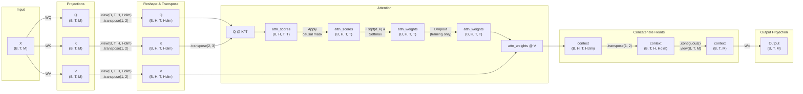
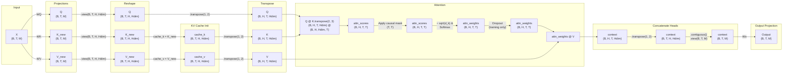
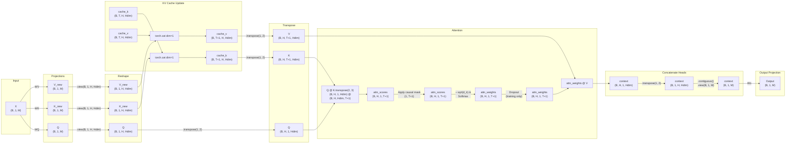

### No KV Cache

```mermaid
flowchart LR
    subgraph Input
        X["X<br/>(B, T, M)"]
    end
    
    subgraph Projections
        X -->|WQ| Q1["Q<br/>(B, T, M)"]
        X -->|WK| K1["K<br/>(B, T, M)"]
        X -->|WV| V1["V<br/>(B, T, M)"]
    end
    
    subgraph Reshape_Transpose["Reshape & Transpose"]
        Q1 -->|".view(B, T, H, Hdim)<br/>.transpose(1, 2)"| Q3["Q<br/>(B, H, T, Hdim)"]
        K1 -->|".view(B, T, H, Hdim)<br/>.transpose(1, 2)"| K3["K<br/>(B, H, T, Hdim)"]
        V1 -->|".view(B, T, H, Hdim)<br/>.transpose(1, 2)"| V3["V<br/>(B, H, T, Hdim)"]
    end
    
    subgraph Attention
        Q3 --> QKT["Q @ K^T"]
        K3 -->|".transpose(2, 3)"| QKT
        QKT --> attn1["attn_scores<br/>(B, H, T, T)"]
        attn1 -->|"Apply <br/>causal mask"| attn2["attn_scores<br/>(B, H, T, T)"]
        attn2 -->|"÷ sqrt(d_k) &<br/>Softmax"| attn3["attn_weights<br/>(B, H, T, T)"]
        attn3 -->|"Dropout <br/>(training only)"| attn4["attn_weights<br/>(B, H, T, T)"]
        attn4 --> matmul["attn_weights @ V"]
        V3 --> matmul
    end
    
    subgraph Concat_Heads["Concatenate Heads"]
        matmul --> context["context<br/>(B, H, T, Hdim)"]
        context -->|".transpose(1, 2)"| context2["context<br/>(B, T, H, Hdim)"]
        context2 -->|".contiguous()<br/>.view(B, T, M)"| context3["context<br/>(B, T, M)"]
    end
    
    subgraph Output_Projection["Output Projection"]
        context3 -->|"Wo"| out["Output<br/>(B, T, M)"]
    end

```

### KV Cache Prefilling

```mermaid
flowchart LR
    subgraph Input
        X["X<br/>(B, T, M)"]
    end
    
    subgraph Projections
        X -->|WQ| Q1["Q<br/>(B, T, M)"]
        X -->|WK| K_new["K_new<br/>(B, T, M)"]
        X -->|WV| V_new["V_new<br/>(B, T, M)"]
    end
    
    subgraph Reshape["Reshape"]
        Q1 -->|".view(B, T, H, Hdim)"| Q2["Q<br/>(B, T, H, Hdim)"]
        K_new -->|".view(B, T, H, Hdim)"| K2["K_new<br/>(B, T, H, Hdim)"]
        V_new -->|".view(B, T, H, Hdim)"| V2["V_new<br/>(B, T, H, Hdim)"]
    end
    
    subgraph KV_Cache["KV Cache Init"]
        K2 -->|"cache_k = K_new"| cache_k["cache_k<br/>(B, T, H, Hdim)"]
        V2 -->|"cache_v = V_new"| cache_v["cache_v<br/>(B, T, H, Hdim)"]
    end
    
    subgraph Transpose["Transpose"]
        Q2 -->|".transpose(1, 2)"| Q3["Q<br/>(B, H, T, Hdim)"]
        cache_k -->|".transpose(1, 2)"| K3["K<br/>(B, H, T, Hdim)"]
        cache_v -->|".transpose(1, 2)"| V3["V<br/>(B, H, T, Hdim)"]
    end
    
    subgraph Attention
        Q3 --> QKT["Q @ K.transpose(2, 3)<br/>(B, H, T, Hdim) @<br/>(B, H, Hdim, T)"]
        K3 --> QKT
        QKT --> attn1["attn_scores<br/>(B, H, T, T)"]
        attn1 -->|"Apply causal mask<br/>(T, T)"| attn2["attn_scores<br/>(B, H, T, T)"]
        attn2 -->|"÷ sqrt(d_k) &<br/>Softmax"| attn3["attn_weights<br/>(B, H, T, T)"]
        attn3 -->|"Dropout<br/>(training only)"| attn4["attn_weights<br/>(B, H, T, T)"]
        attn4 --> matmul["attn_weights @ V"]
        V3 --> matmul
    end
    
    subgraph Concat_Heads["Concatenate Heads"]
        matmul --> context["context<br/>(B, H, T, Hdim)"]
        context -->|".transpose(1, 2)"| context2["context<br/>(B, T, H, Hdim)"]
        context2 -->|".contiguous()<br/>.view(B, T, M)"| context3["context<br/>(B, T, M)"]
    end
    
    subgraph Output_Projection["Output Projection"]
        context3 -->|"Wo"| out["Output<br/>(B, T, M)"]
    end

```

### KV Cache Decoding

```mermaid
flowchart LR
    subgraph Input
        X["X<br/>(B, 1, M)"]
    end
    
    subgraph Projections
        X -->|WQ| Q1["Q<br/>(B, 1, M)"]
        X -->|WK| K_new["K_new<br/>(B, 1, M)"]
        X -->|WV| V_new["V_new<br/>(B, 1, M)"]
    end
    
    subgraph Reshape["Reshape"]
        Q1 -->|".view(B, 1, H, Hdim)"| Q2["Q<br/>(B, 1, H, Hdim)"]
        K_new -->|".view(B, 1, H, Hdim)"| K2["K_new<br/>(B, 1, H, Hdim)"]
        V_new -->|".view(B, 1, H, Hdim)"| V2["V_new<br/>(B, 1, H, Hdim)"]
    end
    
    subgraph KV_Cache["KV Cache Update"]
        prev_cache_k["cache_k<br/>(B, T, H, Hdim)"] --> concat_k["torch.cat dim=1"]
        K2 --> concat_k
        concat_k --> cache_k_new["cache_k<br/>(B, T+1, H, Hdim)"]
        
        prev_cache_v["cache_v<br/>(B, T, H, Hdim)"] --> concat_v["torch.cat dim=1"]
        V2 --> concat_v
        concat_v --> cache_v_new["cache_v<br/>(B, T+1, H, Hdim)"]
    end
    
    subgraph Transpose["Transpose"]
        Q2 -->|".transpose(1, 2)"| Q3["Q<br/>(B, H, 1, Hdim)"]
        cache_k_new -->|".transpose(1, 2)"| K3["K<br/>(B, H, T+1, Hdim)"]
        cache_v_new -->|".transpose(1, 2)"| V3["V<br/>(B, H, T+1, Hdim)"]
    end
    
    subgraph Attention
        Q3 --> QKT["Q @ K.transpose(2, 3)<br/>(B, H, 1, Hdim) @<br/>(B, H, Hdim, T+1)"]
        K3 --> QKT
        QKT --> attn1["attn_scores<br/>(B, H, 1, T+1)"]
        attn1 -->|"Apply causal mask<br/>(1, T+1)"| attn2["attn_scores<br/>(B, H, 1, T+1)"]
        attn2 -->|"÷ sqrt(d_k) &<br/>Softmax"| attn3["attn_weights<br/>(B, H, 1, T+1)"]
        attn3 -->|"Dropout<br/>(training only)"| attn4["attn_weights<br/>(B, H, 1, T+1)"]
        attn4 --> matmul["attn_weights @ V"]
        V3 --> matmul
    end
    
    subgraph Concat_Heads["Concatenate Heads"]
        matmul --> context["context<br/>(B, H, 1, Hdim)"]
        context -->|".transpose(1, 2)"| context2["context<br/>(B, 1, H, Hdim)"]
        context2 -->|".contiguous()<br/>.view(B, 1, M)"| context3["context<br/>(B, 1, M)"]
    end
    
    subgraph Output_Projection["Output Projection"]
        context3 -->|"Wo"| out["Output<br/>(B, 1, M)"]
    end
```

